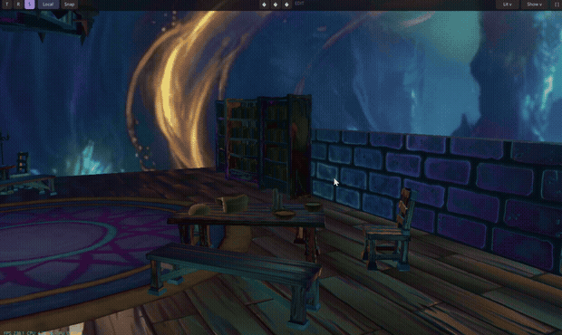
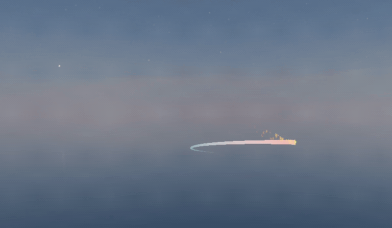
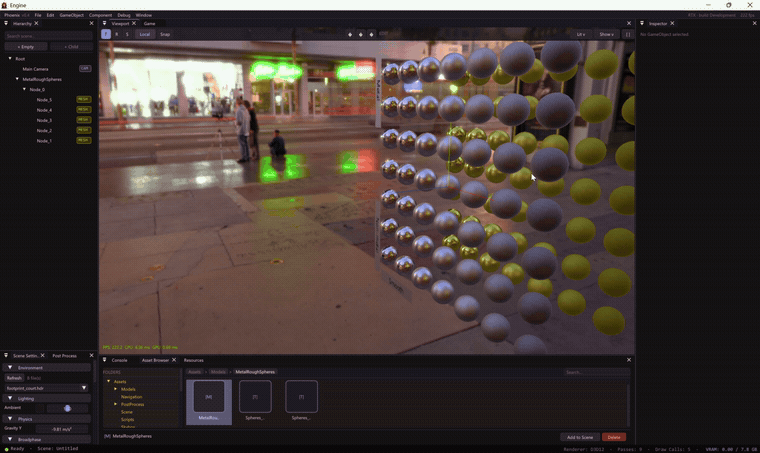

# Phoenix Engine

A DirectX 12 game engine built from scratch in modern C++ — deferred PBR rendering, GPU-driven particle VFX, a full post-process stack, skeletal animation, physics, AI navigation, and an in-editor UI toolkit, all wrapped in a custom ImGui editor.

**Repository:** [github.com/Anand-Ramnarain-27/Anand-PhoenixEngine](https://github.com/Anand-Ramnarain-27/Anand-PhoenixEngine)

---

## Engine in Action

*GIFs and screenshots showing the systems below in motion go here — see [`docs/media/`](docs/media/).*

<!--
| Deferred lighting | GPU particles & bloom | PBR reflections |
|---|---|---|
|  |  |  |
-->

---

## Overview

Phoenix Engine is an independent, from-scratch engine project — not a game built on top of an existing engine. Every system below (the renderer, the compute-based VFX, the animation and physics pipelines, the editor itself) is original code written against the raw DirectX 12 API. It's used as both a rendering R&D sandbox and the base for [Ashfall](https://github.com/Anand-Ramnarain-27/ashfall), a small dungeon-crawler prototype exported from it.

50 HLSL shaders, ~9 of them compute shaders driving simulation and lighting work on the GPU rather than the CPU.

---

## Rendering & Lighting Pipeline

- **Deferred PBR pipeline** — GBuffer pass (albedo, normal/metal/roughness, emissive/AO, depth) followed by a lighting pass that supports an arbitrary number of directional, point, and spot lights
- **Compute-based light culling** (`LightCullingCS.hlsl`) — tile-based culling to keep the lighting pass cheap as light counts scale
- **Shadow mapping** — cascaded directional shadow maps with PCF / VSM / ESM filtering options, spot light shadow maps, point light cube maps; GPU-side shadow map reduction and blur (`ShadowReduceCS`, `ShadowBlurCS`)
- **Image-based lighting** — HDR skybox → irradiance map and environment BRDF convolution for physically-based reflections
- **Frustum culling** against the octree/grid broadphase, with a debug view to visualize what's being culled
- **Decals**, **volumetric fog** (compute-driven), and forward + deferred hybrid paths where needed

## VFX & Particle Systems

- **GPU-simulated particles** (`ParticleUpdateCS.hlsl`) — per-frame simulation in a compute shader writing to a `StructuredBuffer`, rendered via GPU instancing rather than CPU-side updates
- **GPU noise** — an 8-octave FBM noise shader used to drive turbulence in particle motion
- **Trail/ribbon renderer** with configurable width and colour-over-lifetime curves, used for comet/ember-style effects
- **Billboard pass** for camera-facing sprites and impostors

## Post-Processing

- Bloom (Kawase-style multi-pass downsample/upsample, threshold + intensity control)
- Exposure/tonemapping, colour LUT grading, FXAA, chromatic aberration, fog
- All post-process stages are individually toggleable at runtime from the editor for fast A/B comparison

## Materials

- Full PBR material model — albedo, normal, roughness, metallic, ambient occlusion, and emissive maps, each independently overridable per-instance
- Real-time material editing from the editor, with immediate visual feedback in the scene view

## Animation

- GPU skeletal skinning (`SkinningCS.hlsl`) and GPU morph-target blending (`MorphSkinningCS.hlsl`)
- A visual finite-state-machine editor for authoring animation graphs (states, transitions, triggers), with clip playback and scrubbing from the inspector

## Physics & Collision

- Three swappable broad-phase strategies (brute-force, uniform grid, octree) so collision performance can be profiled and compared per-scene
- Mid/narrow-phase with OBB-SAT for oriented boxes, sphere and AABB dispatch, and a swept-AABB path for fast-moving objects to avoid tunneling
- Impulse-based collision response (mass, velocity, restitution) via `ComponentRigidbody`

## AI & Navigation

- Waypoint-graph and navmesh-based pathfinding behind a common `INavProvider` interface
- Steering behaviours (seek/flee/arrive/wander) and a simple perception system, exposed to gameplay code through a scripting API rather than baked into engine-side "enemy AI" — behaviour is authored per-game, not per-engine

## In-Engine UI System

- A DirectXTK12-backed UI pass with Canvas/Transform2D layout, and Image/Label/Button/ProgressBar/CheckBox/Slider/InputBox widgets, driven by the same input system as gameplay

## Engine Infrastructure

- **Multithreaded asset pipeline** — background import worker pool (mesh/texture/animation import off the main thread) with a manifest cache so re-imports are skipped when nothing changed
- **PSO and shader caching** to cut cold-start time; parallel module initialization at boot
- **GPU profiling via PIX** — `PIXBeginEvent`/`PIXEndEvent`/`PIXSetMarker` instrumentation wired through every render pass for frame capture and analysis in PIX
- Hot-reloadable shaders (edit `.hlsl`, recompile to `.cso`, no engine restart)
- A separate `GameScript.dll` layer so gameplay/AI code can be edited and hot-reloaded independently of the engine binary

## Editor & Tools

- ImGui-based editor: docking layout, scene hierarchy, inspector, asset browser, console
- Real-time performance overlay (FPS, CPU/GPU frame time, draw calls, GPU memory)
- Translate/rotate/scale gizmos, debug draw for AABBs/broadphase cells/frustum/nav data
- Drag-and-drop asset ingestion straight from File Explorer

---

## System Requirements

- **OS:** Windows 10/11 (64-bit)
- **GPU:** DirectX 12 compatible
- **Build tool:** Visual Studio 2022

## Download a Build

Prebuilt Windows binaries are published on the [Releases page](https://github.com/Anand-Ramnarain-27/Anand-PhoenixEngine/releases) — grab the latest zip, extract, and run `PhoenixEngine.exe`, no build step required.

| Version | Highlights |
|---|---|
| [v0.4](https://github.com/Anand-Ramnarain-27/Anand-PhoenixEngine/releases/tag/PhoenixEngine_0.4) | Deferred rendering with tiled/clustered light culling, skeletal animation + state machines, collision/physics, GPU-driven VFX |
| [v0.3](https://github.com/Anand-Ramnarain-27/Anand-PhoenixEngine/releases/tag/v0.3-advanced-system) | GameObject/Component architecture, prefab system, image-based lighting |
| [v0.2](https://github.com/Anand-Ramnarain-27/Anand-PhoenixEngine/releases/tag/PhoenixEngine-v0.2) | Phong shading, transform gizmos, material editing |
| [v0.1](https://github.com/Anand-Ramnarain-27/Anand-PhoenixEngine/releases/tag/PhoenixEngine-v0.1) | Foundational textured-quad viewer |

## Build from Source

```bash
git clone https://github.com/Anand-Ramnarain-27/Anand-PhoenixEngine.git
```

1. Open `Source/PhoenixEngine.sln` in Visual Studio 2022
2. Build in **Release** (recommended for real-time performance) or **Debug**
3. Run `PhoenixEngine.exe` from the build output folder

## Controls

| Action | Input |
|---|---|
| Move camera | Right-click + WASD |
| Look around | Right-click + drag |
| Zoom | Mouse wheel |
| Orbit selection | Alt + left-click + drag |
| Focus on object | F |
| Speed boost | Hold Shift |

---

## License

Licensed under the **MIT License** — see [LICENCE.md](LICENCE.md). Third-party libraries are included with their respective licenses in `Licences/`.

## Author

**Anand Ramnarain**
